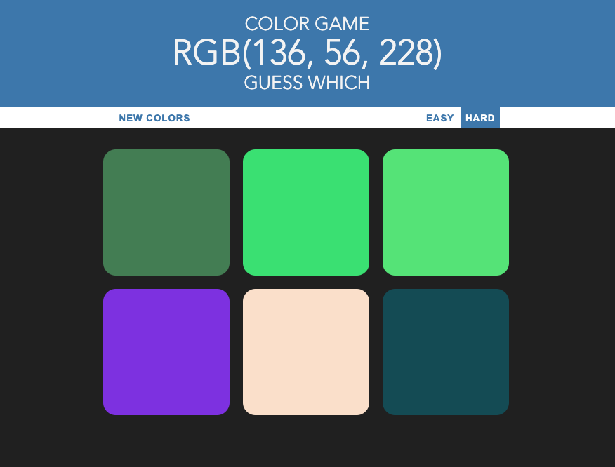
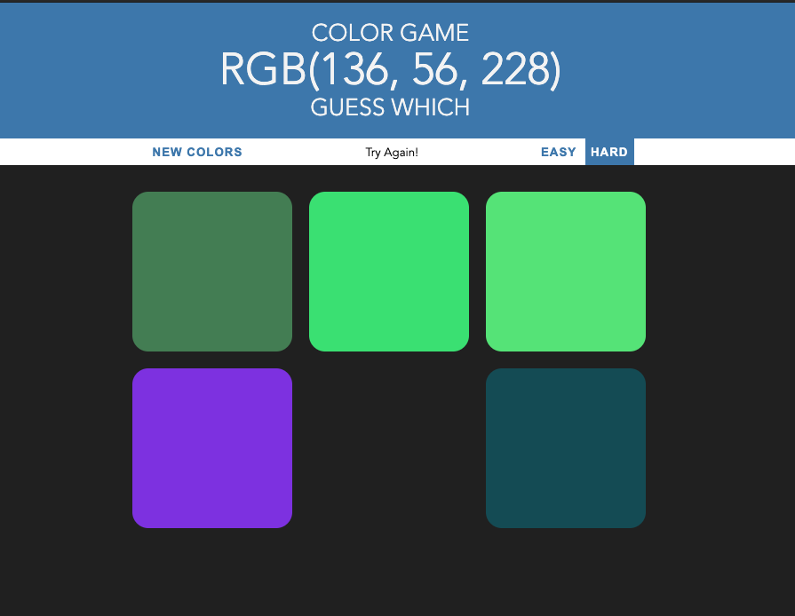
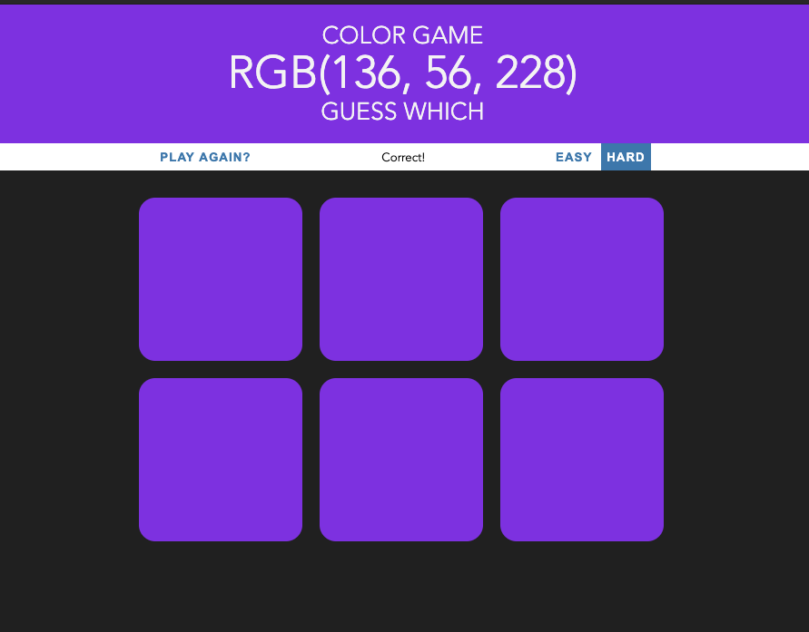

# Color Game

Published : https://kseniask.github.io/color_game/

Game based on JavaScript. The RGB code is given to the user and the task is to find what color is it.

There are two levels easy (3 colors) and hard (6 colors). If the user clicks on the wrong color, it disappears.

And if the user chose the right one, all squares become that color and the new game can be started.

User can change the game anytime by clicking "new colors" button.
